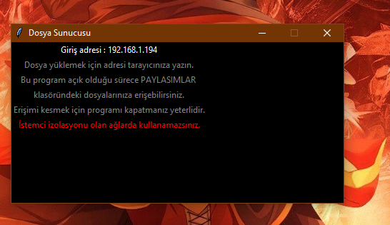

# FileServer_DosyaSunucusu
Yerel ağ için basit dosya sunucusu. Yükleme ve indirme. Dosyaların paylaşımında herhangi bir şifreleme eklenmemiştir. Muhtemelen sadece yerel ağda çalışıyor güvenlik için (?) Program kapanırken güvenlik duvarına eklediği tüm portları geri siliyor tekrar açarken yine ekliyor.
* Kullanımı:
```sh
  Uygulamayı yönetici olarak çalıştırın.
 ```
* Usage:
```sh
  Run the app as administrator.
 ```
 * Ekran Alıntıları:
<p align="center">
  <a href="https://github.com/ny4rlk0/FileServer_DosyaSunucusu/">
    
  </a>
    <a href="https://github.com/ny4rlk0/FileServer_DosyaSunucusu/">
    
  </a>
    <a href="https://github.com/ny4rlk0/FileServer_DosyaSunucusu/">
    
  </a>
    <a href="https://github.com/ny4rlk0/FileServer_DosyaSunucusu/">
    
  </a>
    <a href="https://github.com/ny4rlk0/FileServer_DosyaSunucusu/">
    
  </a>
    <a href="https://github.com/ny4rlk0/FileServer_DosyaSunucusu/">
    
  </a>
* Screen Shots:
    <a href="https://github.com/ny4rlk0/FileServer_DosyaSunucusu/">
    
  </a>
    <a href="https://github.com/ny4rlk0/FileServer_DosyaSunucusu/">
    
  </a>
    <a href="https://github.com/ny4rlk0/FileServer_DosyaSunucusu/">
    
  </a>
    <a href="https://github.com/ny4rlk0/FileServer_DosyaSunucusu/">
    
  </a>
    <a href="https://github.com/ny4rlk0/FileServer_DosyaSunucusu/">
    
  </a>
    <a href="https://github.com/ny4rlk0/FileServer_DosyaSunucusu/">
    
  </a>
